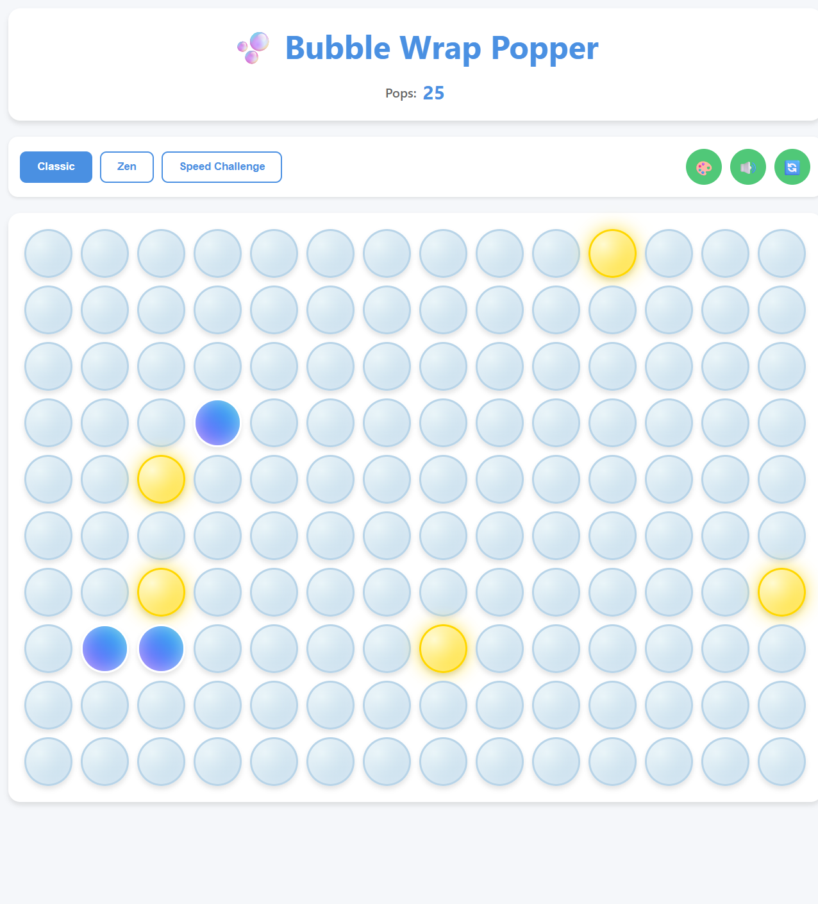
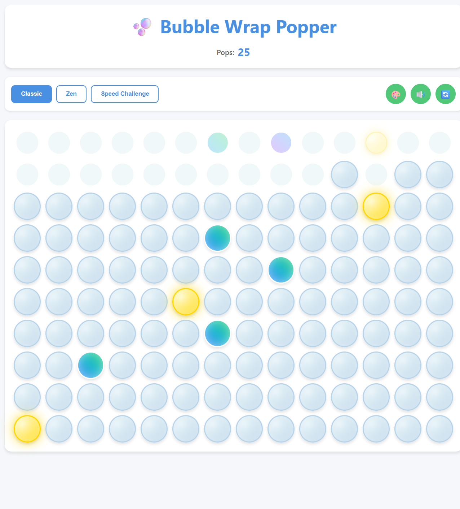
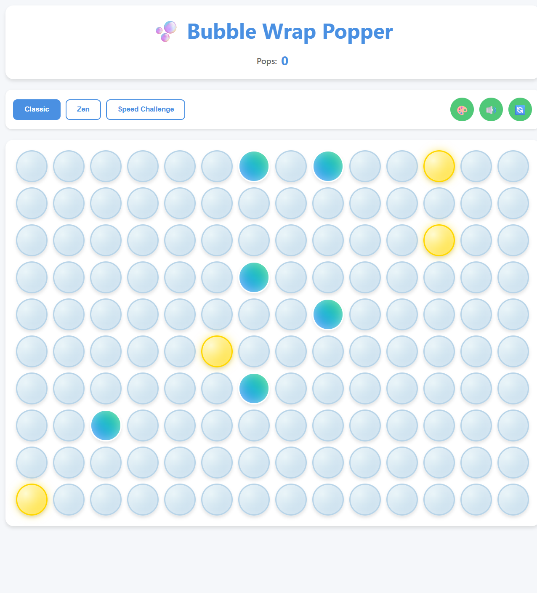
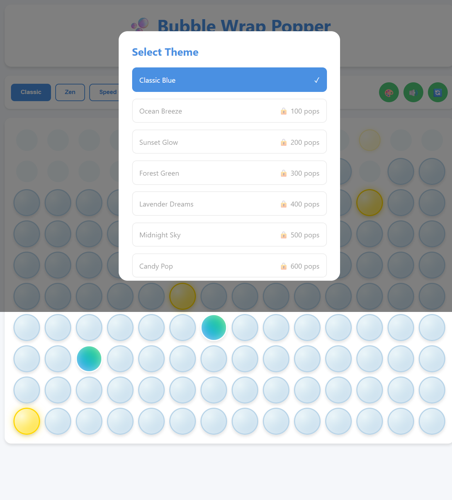
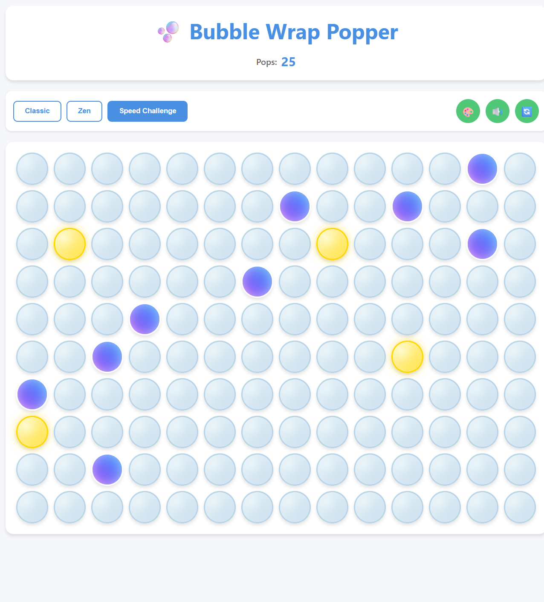

# 🫧 Bubble Pop - Interactive Bubble Wrap Simulator

A satisfying and therapeutic browser-based bubble wrap popping game with special bubbles, sound effects, and multiple game modes. Experience the joy of popping bubble wrap without the waste!



## 🎯 Project Overview

Bubble Pop is an engaging web-based simulation that recreates the satisfying experience of popping bubble wrap. Built with vanilla JavaScript, HTML5, and CSS3, this game offers a stress-relieving experience with beautiful animations, realistic sound effects, and multiple gameplay modes to keep you entertained.

## ✨ Features

- **🎮 Multiple Game Modes**
  - **Classic Mode**: Endless bubble popping with progress tracking
  - **Zen Mode**: Relaxing experience with calming colors and sounds
  - **Speed Challenge**: Race against time to pop as many bubbles as possible

- **🎨 Dynamic Themes**
  - 9 beautiful unlockable themes (Classic Blue, Ocean Breeze, Sunset Glow, etc.)
  - Themes unlock as you reach pop milestones
  - Smooth color transitions and visual effects

- **🔊 Immersive Audio**
  - Realistic bubble popping sounds
  - Web Audio API for crisp sound generation
  - Toggle sound on/off
  - Different frequencies for special bubbles

- **✨ Special Bubbles**
  - **Golden Bubbles**: Rare bubbles worth extra points
  - **Rainbow Bubbles**: Ultra-rare with special effects
  - Dynamic bubble regeneration for endless gameplay

- **📊 Progress Tracking**
  - Total pop counter with local storage persistence
  - Achievement milestones (50, 100, 250, 500, 1000+ pops)
  - Theme unlocking system based on progress

- **📱 Responsive Design**
  - Works seamlessly on desktop, tablet, and mobile devices
  - Touch-friendly interface
  - Adaptive grid sizing

## 🎮 How to Play

1. **Choose Your Mode**: Select from Classic, Zen, or Speed Challenge modes
2. **Start Popping**: Click or tap bubbles to pop them
3. **Watch for Special Bubbles**: 
   - Golden bubbles (5% chance) - Extra satisfying pops
   - Rainbow bubbles (3% chance) - Rare treats with special effects
4. **Unlock Themes**: Keep popping to reach milestones and unlock new visual themes
5. **Customize**: Use the theme selector to change colors and the sound toggle for audio preferences
6. **Track Progress**: Monitor your total pops and see how many bubbles you've popped overall



## 🚀 Installation / Running Instructions

### Option 1: Live Server (Recommended for Development)
1. Clone or download this repository
```bash
git clone https://github.com/HadassahLevi/bubble-pop.git
cd bubble-pop
```

2. Open the project in VS Code
3. Install the Live Server extension if not already installed
4. Right-click on `index.html` and select "Open with Live Server"
5. The game will open in your browser at `http://localhost:5500`

### Option 2: Direct File Opening
1. Download the project files
2. Open `index.html` directly in any modern web browser
3. Start popping bubbles immediately!

### Option 3: Web Server
If you have Python installed:
```bash
# Python 3
python -m http.server 8000

# Python 2
python -m SimpleHTTPServer 8000
```
Then visit `http://localhost:8000`

## 🖼️ Screenshots

| Main Game Interface | Theme Selection | Speed Challenge Mode |
|:-------------------:|:---------------:|:--------------------:|
|  |  |  |

## 🛠️ Technologies Used

- **HTML5**: Semantic markup and structure
- **CSS3**: 
  - Flexbox and Grid layouts
  - CSS animations and transitions
  - CSS custom properties (variables) for theming
  - Responsive design with media queries
- **Vanilla JavaScript (ES6+)**:
  - Class-based architecture
  - Web Audio API for sound generation
  - Local Storage for progress persistence
  - Event delegation and DOM manipulation
  - Modern JavaScript features (arrow functions, destructuring, etc.)

## 🎯 Game Mechanics

- **Grid Generation**: Dynamic bubble grid creation based on screen size
- **Pop Physics**: Realistic bubble popping animations with CSS transforms
- **Sound System**: Procedural audio generation using Web Audio API
- **Theme System**: Dynamic CSS custom property manipulation
- **Progress System**: Local storage integration for persistent progress
- **Special Bubble Logic**: Probability-based special bubble spawning

## 🔮 Future Improvements

- [ ] **Multiplayer Mode**: Compete with friends in real-time
- [ ] **Achievement System**: Badges and rewards for specific milestones
- [ ] **Custom Sound Packs**: Different audio themes and effects
- [ ] **Bubble Physics**: More realistic bubble movement and interaction
- [ ] **Daily Challenges**: Special objectives and limited-time events
- [ ] **Accessibility Features**: Screen reader support and keyboard navigation
- [ ] **Mobile App Version**: Native iOS and Android applications
- [ ] **Social Features**: Share achievements and compete on leaderboards
- [ ] **Power-ups**: Temporary effects like multi-pop or golden bubble bonuses
- [ ] **Visual Effects**: Particle systems and advanced animations

## 🤝 Contributing

Contributions are welcome! Here's how you can help:

1. Fork the repository
2. Create a feature branch (`git checkout -b feature/amazing-feature`)
3. Commit your changes (`git commit -m 'Add some amazing feature'`)
4. Push to the branch (`git push origin feature/amazing-feature`)
5. Open a Pull Request

## 📋 Development Setup

For developers wanting to contribute:

```bash
# Clone the repository
git clone https://github.com/HadassahLevi/bubble-pop.git

# Navigate to project directory
cd bubble-pop

# Open in your preferred editor
code .

# Start development server (using Live Server or similar)
```

## 📄 License

This project is licensed under the MIT License - see the [LICENSE](LICENSE) file for details.

## 🎉 Acknowledgments

- Inspired by the universal love of popping bubble wrap
- Built with modern web technologies for optimal performance
- Designed with accessibility and user experience in mind

---

**Enjoy popping! 🫧✨**

*Made with ❤️ for stress relief and pure satisfaction*
